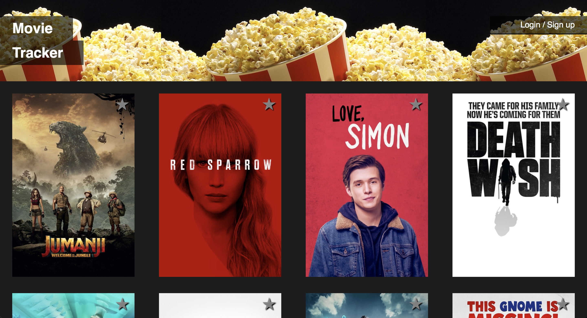

# Movie Box (Movie Tracker) - Alex Bonder, Ricardo Viera, Nyssa Keller - (FE Mod 3)

## Synopsis

Movie tracker is an app designed to gather all of the latest movies from [The Movie Database](https://www.themoviedb.org/) and display them on cards. Users can select and view their favorite movies.

## Project Goals

* Learn React, Redux, and React Router.
* Create modular, reusable React components.
* Use propTypes to validate props passed to each component.
* Write meaningful, comprehensive unit and integration tests.
* Access and consume data from [The Movie Database API](https://www.themoviedb.org/documentation/api)

## Installation

This application was built using the `create-react-app` boilerplate. This boilerplate provides a lot of built in content and dependencies for free. The [documentation](https://github.com/facebookincubator/create-react-app) is avialable to read through.

To set up: 

Fork or clone this project

Run `npm install` from the root directory

You will need to get an API Key from [The Movie Database](https://www.themoviedb.org/documentation/api)

In `/src` create a file `apiKey.js`

Add the following...

```javascript
// /src/apiKey.js

const apiKey = '(your api key)';

export default apiKey;

// Remember to add this file to your .gitignore
```

Run `npm start` and visit localhost:3000 in your browser

You can begin running your tests with `npm test`

## Tests

The testing Enzyme documentation is helpful for this project:
[create-react-app
setupTests.js](https://github.com/facebookincubator/create-react-app/blob/master/packages/react-scripts/template/README.md#initializing-test-environment)  
[initializing the enzyme adapter](http://airbnb.io/enzyme/docs/installation/react-15.html)

The tests are a compilation of unit and integration tests to simulate the methods and events happening in the application.

## Contributors

Alex Bonder, Ricardo Viera, and Nyssa Keller are the project developers.

## Screenshots


